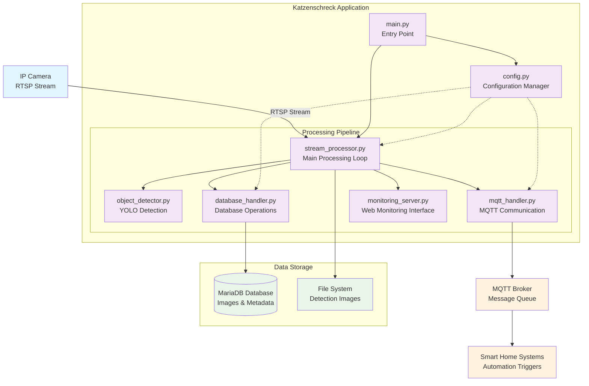

# Katzenschreck System Architecture

## High-Level Overview

```
┌─────────────────┐    ┌─────────────────┐    ┌─────────────────┐    ┌─────────────────┐
│   IP Camera     │    │  Katzenschreck  │    │   MariaDB       │    │  Schreckmonitor │
│  (RTSP Stream)  │───▶│     System      │───▶│   Database      │───▶│   Desktop-App   │
└─────────────────┘    └─────────────────┘    └─────────────────┘    └─────────────────┘
                              │
                              ▼
                       ┌─────────────────┐
                       │  MQTT Broker    │
                       │  (Notifications)│
                       └─────────────────┘
                              │
                              ▼
                       ┌─────────────────┐
                       │  Smart Home     │
                       │  Integration    │
                       │ (Sprinkler etc.)│
                       └─────────────────┘
```

## Detailed System Architecture



## Component Details

### Core Modules

#### 1. **main.py** - Application Entry Point
- Argument parsing
- Application initialization
- Error handling and logging

#### 2. **config.py** - Configuration Management
- Configuration file parsing
- Environment variable handling
- Parameter validation

#### 3. **stream_processor.py** - Main Processing Engine
- RTSP stream handling
- Frame processing coordination
- Error recovery and reconnection

#### 4. **object_detector.py** - AI Detection Core
- YOLO model integration
- Cat detection algorithms
- Ignore zone filtering
- Confidence threshold management

#### 5. **database_handler.py** - Data Persistence
- MariaDB connection management
- Image storage (original + thumbnails)
- Metadata recording
- Connection pooling

#### 6. **mqtt_handler.py** - Real-time Communications
- MQTT broker connection
- Detection event publishing
- Health monitoring (ping)
- Message formatting

#### 7. **monitoring_server.py** - Web Monitoring Interface
- FastAPI-based HTTP server
- MJPEG video streaming
- Real-time statistics API
- Web-based user interface
- Thread-safe frame distribution

### Data Flow

1. **Input**: IP Camera streams video via RTSP
2. **Processing**: Stream processor captures frames
3. **Detection**: YOLO analyzes frames for cats
4. **Storage**: Positive detections stored in database + filesystem
5. **Notification**: MQTT messages sent to smart home systems
6. **Action**: External systems (sprinklers) triggered

### Storage Schema

```
detections_images Table:
├── id (PRIMARY KEY)
├── camera_name (VARCHAR)
├── accuracy (DECIMAL) - 0.0 for monitoring, >0.0 for detections
├── blob_jpeg (LONGBLOB) - Original image
├── thumbnail_jpeg (BLOB) - 300px thumbnail
└── created_at (TIMESTAMP)
```

## Deployment Architecture

### Option A: Native Deployment
```
┌─────────────────────────────────┐
│         Host System             │
│  ┌─────────────────────────────┐│
│  │    Python Virtual Env       ││
│  │  ┌─────────────────────────┐││
│  │  │   Katzenschreck App     │││
│  │  └─────────────────────────┘││
│  └─────────────────────────────┘│
│  ┌─────────────────────────────┐│
│  │      MariaDB Server         ││
│  └─────────────────────────────┘│
└─────────────────────────────────┘
```

### Option B: Docker Deployment
```
┌─────────────────────────────────┐
│         Docker Host             │
│  ┌─────────────────────────────┐│
│  │   Katzenschreck Container   ││
│  │  ┌─────────────────────────┐││
│  │  │     Application         │││
│  │  │   + Dependencies        │││
│  │  └─────────────────────────┘││
│  └─────────────────────────────┘│
│  ┌─────────────────────────────┐│
│  │   MariaDB Container         ││
│  └─────────────────────────────┘│
└─────────────────────────────────┘
```

## Integration Points

### External Systems
- **MQTT Brokers**: Mosquitto, HiveMQ, AWS IoT Core
- **Smart Home**: Home Assistant, OpenHAB, NodeRED
- **Cameras**: Any RTSP-compatible IP camera
- **Databases**: MariaDB, MySQL (compatible)

### Network Requirements
- **RTSP**: Camera stream access
- **MQTT**: Port 1883 (unencrypted) or 8883 (TLS)
- **Database**: Port 3306 (MariaDB/MySQL)
- **HTTP**: Port 8080 (default) for monitoring interface (configurable)

## Performance Characteristics

- **Frame Processing**: ~1-5 FPS (depending on hardware)
- **Detection Latency**: <2 seconds from capture to MQTT
- **Storage**: ~100KB per detection (with thumbnail)
- **CPU Usage**: Moderate (YOLO inference)
- **Memory**: ~500MB-2GB (model dependent)
- **Monitoring Overhead**: Minimal (~5-10% additional CPU for web server, configurable FPS limit)

## Security Considerations

- Database credentials in configuration
- MQTT authentication required
- RTSP stream credentials
- File system permissions
- Network isolation recommended
