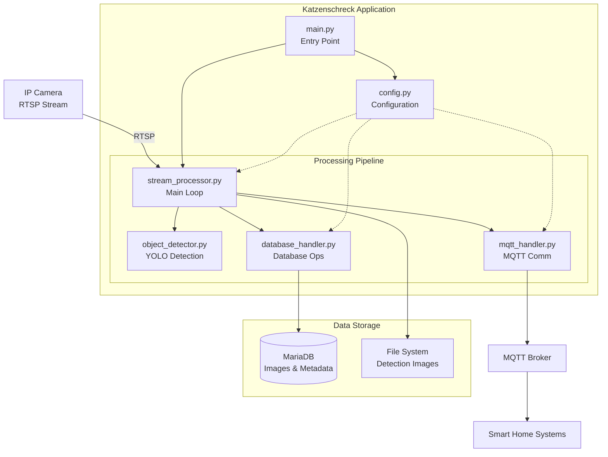

# Katzenschreck-FCATS

(a) Fully Configurable Automated Tracking Software: A containerized end-to-end monitoring system that uses YOLO object detection to identify cats from ip-camera streams, stores results in a database, and sends real-time alerts via MQTT. This might be used to trigger your sprinkler...

**Tested and running 24/7 on Raspberry Pi 3, 4 and NVIDIA Jetson Xavier NX Developer Board** by the author, providing reliable cat detection in real-world garden environments.


## Hardware Requirements & Performance

The inference script can run on a Raspberry Pi, but an accelerated device like a **Jetson Nano** is highly recommended for better performance.

**Real-world performance measurements (based on YOLO11x):**
- **Raspberry Pi 3**: Over 50 seconds per frame (which might be sufficient for detecting a cat)
- **Raspberry Pi 4**: ~22 seconds per frame
- **Jetson Xavier NX Developer Board**: 180ms per frame

## Features

- **Object Detection**: Automatic cat detection using YOLO
- **MQTT Integration**: Send notifications when detections occur
- **Database Storage**: Automatic frame storage every hour and detection images in MariaDB
- **RTSP Stream Support**: Support for IP cameras with RTSP protocol
- **Ignore Zones**: Configurable areas to be ignored
- **Image Generation**: Automatic creation of 300px wide thumbnails & detection-images.

## Installation & Setup

Follow these steps in order:

### 1. Set up database
First, create the database and required tables. Adjust the script to your needs:
```bash
mysql -u root -p < database_setup.sql
```

### 2. Configure the system
Create and edit the configuration file:
```bash
cp config.txt.example config.txt
# Edit config.txt with your RTSP stream, MQTT broker, and database settings
```

### 3. Run the application

Choose one of the following deployment methods:

#### Option A: Native Execution (Recommended for Development)
Use the start script to automatically set up the environment and run the system natively:
```bash
./start_script.sh
```

**Note**: The start script will automatically:
- Create a Python virtual environment in `cat_detector/venv/`
- Install all required dependencies from `requirements.txt`
- Activate the virtual environment
- Run the detection system

#### Option B: Docker Container (Recommended for Production)
Build and run the application in a Docker container:

```bash
# Build the Docker image
docker build -t katzenschreck .

# Run the container with volume mounts for config and output
docker run -d \
  --name katzenschreck-container \
  -v $(pwd)/config.txt:/app/config.txt:ro \
  -v $(pwd)/results:/app/results \
  katzenschreck
```

**Docker Benefits**:
- Isolated environment with all dependencies
- Consistent deployment across different systems
- Easy scaling and orchestration
- No need to manage Python environments locally

## Manual Usage

If you prefer to run manually without automation:

```bash
cd cat_detector
python3 -m venv venv
source venv/bin/activate
pip install -r requirements.txt
python main.py <output_folder>
```

## Architecture

### System Overview
```
┌─────────────────┐    ┌─────────────────┐    ┌─────────────────┐    ┌─────────────────┐
│   IP Camera     │    │  Katzenschreck  │    │   MariaDB       │    │  Schreckmonitor │
│  (RTSP Stream)  │───▶│     System      │───▶│   Database      │───▶│   Desktop-App   │
└─────────────────┘    └─────────────────┘    └─────────────────┘    └─────────────────┘
                              │
                              ▼
                       ┌─────────────────┐
                       │  MQTT Broker    │
                       │  (Notifications)│
                       └─────────────────┘
                              │
                              ▼
                       ┌─────────────────┐
                       │  Smart Home     │
                       │  Integration    │
                       │ (Sprinkler etc.)│
                       └─────────────────┘
```

### Detailed Architecture


> 📋 **Detailed Architecture**: See [ARCHITECTURE.md](ARCHITECTURE.md) for comprehensive system documentation, deployment options, and integration details.

## Configuration

The `config.txt` should contain the following parameters:

- **RTSP Stream**: `rtsp_stream_url`
- **MQTT**: `mqtt_broker_url`, `mqtt_topic`, etc.
- **Database**: `db_host`, `db_user`, `db_password`, `db_database`
- **Object Detection**: `confidence_threshold`, `ignore_zone`

## Database Schema

The system automatically stores frames in the `detections_images` table:
- `camera_name`: Camera name
- `accuracy`: Accuracy value (0.0 for monitoring images, >0.0 for detections)
- `blob_jpeg`: JPEG image data as BLOB
- `thumbnail_jpeg`: 300px wide thumbnail as BLOB
- `created_at`: Storage timestamp

## Module Structure

The application is organized into modular components:

- **`config.py`**: Configuration management
- **`mqtt_handler.py`**: MQTT communication
- **`database_handler.py`**: Database operations and thumbnail creation
- **`object_detector.py`**: YOLO-based cat detection
- **`stream_processor.py`**: Video stream processing coordination
- **`main.py`**: Application entry point

## Detection Logic

- **Monitoring Images**: Saved every hour with accuracy = 0.0
- **Detection Images**: Saved when cats are detected with accuracy = YOLO confidence
- **File Storage**: Detection images also saved as annotated files in output folder
- **MQTT Notifications**: Real-time alerts sent for each detection

## TODO

### DevOps & Infrastructure
- [ ] Verify Docker container functionality
- [ ] Set up CI/CD pipeline (GitHub Actions/GitLab CI)
- [*] Implement health checks and monitoring endpoints
- [ ] Add Prometheus metrics collection
- [ ] Create Kubernetes deployment manifests
- [ ] Add environment-specific configurations (different locations!)

### Code Quality & Testing
- [ ] Add unit tests for all modules
- [ ] Implement integration tests
- [ ] Set up code coverage reporting
- [ ] Add linting and formatting (black, flake8, mypy)
- [ ] Add security scanning (bandit, safety)
- [ ] Implement automated dependency updates (Dependabot)

### Documentation & Usability
- [*] Create architecture diagrams
- [ ] Add troubleshooting guide
- [ ] Document performance tuning recommendations
- [*] Add screenshot
- [ ] Add changelog maintenance

### Security & Production Readiness
- [ ] Implement proper secret management and config management for Docker container
- [ ] Add SSL/TLS support for MQTT
